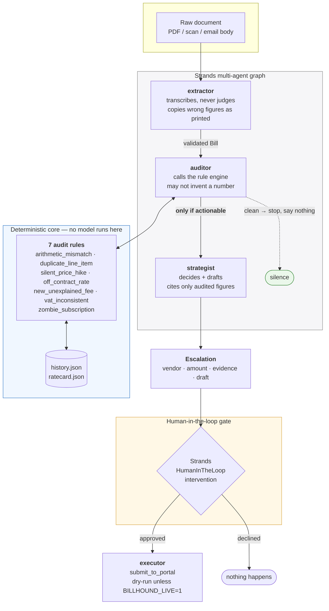

# BillHound

**An agent that reads every bill you get, and only speaks when it matters.**

Built with the [Strands Agents SDK](https://strandsagents.com) on Amazon Bedrock.
Submitted to the [Agents for Humans Hackathon](https://agentsforhumans.devpost.com/)
— *Everyday Agents* track.

---

## The problem

Nobody audits their own bills. A German household carries around a dozen recurring
vendors — energy, internet, insurance, streaming, mobile — and each one sends a
statement every month that takes four minutes to check properly. That is roughly an
hour a month of tedious arithmetic to catch something that happens maybe twice a year.

So nobody does it. Tariffs drift upward, service fees appear, a charge gets duplicated,
a subscription outlives its usefulness by two years, and it all just gets paid.

The work is not hard. It is *repetitive, low-yield, and unbounded* — which is exactly
the shape of work that should not belong to a human.

## What BillHound does

It reads every bill. It stays quiet about almost all of them.

```
  Kabelnetz Bayern KB-2026-09: clean, nothing to report

  DISPUTE  Stadtwerke Muenchen  invoice SWM-2026-09
  26.90 EUR at stake
  Stadtwerke Muenchen overcharged 26.90 EUR on invoice SWM-2026-09 across 4 items.

  [HIGH  ] 'Arbeitspreis Strom kWh' billed above the agreed rate
           Contract rate is 0.32 EUR; invoice SWM-2026-09 charges 0.38 x210 = 79.80 EUR.
           rule: off_contract_rate  |  12.60 EUR

  [HIGH  ] Line items do not sum to the invoice total
           Line items total 124.36 EUR, but the invoice is billed at 131.36 EUR.
           rule: arithmetic_mismatch  |  7.00 EUR

  [HIGH  ] 'servicepauschale' billed 2 times
           'servicepauschale' at 4.90 EUR appears 2 times on invoice SWM-2026-09.
           rule: duplicate_line_item  |  4.90 EUR

  ...

  Drafted email to rechnung@swm-kundenservice.example
  Nothing has been sent. This is waiting on you.

  3 bills read. 1 handled silently. 2 need you. 26.90 EUR at stake.
```

The measure of this agent is not how much it says. It is how much it *doesn't*.

## Architecture



### The three ideas that matter

**1. The model never does arithmetic.**
Every euro figure comes from [`rules.py`](src/billhound/rules.py) — seven pure
functions, no I/O, no network, no model. An LLM that is 99% accurate at mental
arithmetic is 100% unacceptable when the output is a number you put in front of a
vendor. The auditor agent's entire job is to *call* the rule engine and relay it;
its system prompt forbids adjusting, re-deriving, or rounding anything it returns.

**2. Routing reads state, not prose.**
The conditional edge from `auditor` to `strategist` is
`lambda state: case.is_actionable` — it inspects a
[typed case object](src/billhound/case.py), not the agent's text. A chatty or
confused model cannot talk the pipeline into escalating a clean bill, or into
submitting anything.

**3. Silence is the default and the feature.**
A bill that is merely correct terminates at the auditor. Most runs produce one dim
grey line and nothing else. An agent that surfaces everything has moved the work
rather than removed it.

## Guardrails

| Guardrail | Where |
|---|---|
| Outbound actions require human approval | `HumanInTheLoop(allowed_tools=AUTO_APPROVED)` — `submit_to_portal` is deliberately off the allow-list |
| Submission is dry-run by default | Refuses to act unless `BILLHOUND_LIVE=1` is explicitly set |
| Agents cannot hand each other malformed data | Every tool boundary validates against a Pydantic model and returns `REJECTED` with the reason |
| The same overcharge is never counted twice | `_dedupe_money` — two rules can flag one line item, but the money is claimed once |
| Tax lines are excluded from price rules | VAT is derived; flagging it restates the same overcharge under a misleading name |
| No credentials in the repo or the agent | BillHound drafts and hands off. It never stores or types a password. |

## Try it in 30 seconds — no AWS account needed

The deterministic engine runs with no model, no network and no credentials, which
means you can verify every number the product would ever show you:

```bash
git clone https://github.com/sai2311-eng/billhound && cd billhound
python -m venv .venv && . .venv/Scripts/activate   # Linux/macOS: . .venv/bin/activate
pip install -e ".[dev]"
billhound audit
```

Then the tests — 36 of them, none needing credentials. The two that matter most are
`test_clean_bill_raises_nothing` (a correct bill produces absolutely nothing) and
`test_clean_bill_never_reaches_the_strategist` (the graph proves it, not just the
rules):

```bash
pytest -q
```

## The full agent

Needs AWS credentials with Bedrock model access.

```bash
export AWS_REGION=us-east-1
export BILLHOUND_MODEL=anthropic.claude-sonnet-5
billhound watch --trace
```

`watch` runs the real graph: the extractor reads arbitrary document text rather than
the fixed sample layout, and the strategist writes the dispute letter itself — in
German when the vendor is German.

### Running the graph without AWS

```bash
billhound watch --offline
```

This drives the **real** graph, the real tools, the real conditional edge and the
real HITL intervention — but replies with a scripted `Model` implementation instead
of calling Bedrock. It proves the wiring, not the reasoning, and it says so on every
run. It exists because `watch` is the path that matters, and testing it only against
live Bedrock means never testing it at all.

What it cannot do is the part that genuinely needs a model: reading a document it has
never seen, and writing the letter.

## Repo layout

```
src/billhound/
  rules.py             the 7 deterministic audit rules — the trustworthy core
  schemas.py           Pydantic contracts for every hand-off
  case.py              typed state; edge conditions read this, not model output
  tools.py             Strands tools, bound to one case
  agents.py            extractor / auditor / strategist / executor
  graph.py             GraphBuilder wiring + the conditional edge
  report.py            terminal rendering
  fallback_parser.py   offline parser for the sample layout, so the core demos without AWS
  cli.py               `billhound audit` (offline) and `billhound watch` (Bedrock)
samples/
  stadtwerke/          an overcharging energy provider
  kabelnetz/           a flawless internet provider — the silence case
  streamco/            a correct but immortal subscription
  offline_model.py     a scripted Model implementation, so the graph is testable with no AWS
tests/
  test_rules.py        24 tests on the audit engine — mostly about not lying about money
  test_graph.py        12 end-to-end tests on the real graph and the real HITL gate
```

## What is not built yet

Being straight about the edges:

- **Live portal submission is a dry run.** The plumbing and the approval gate are
  real and tested — declining the gate submits nothing, and approving it still
  dry-runs unless `BILLHOUND_LIVE=1`. Pointing it at a live vendor portal is
  deliberately left disarmed.
- **Ingestion is text.** PDF and scan handling routes through Bedrock vision in
  `watch`; there is no Textract pipeline yet.
- **Storage is JSON on disk.** DynamoDB is the obvious next step, not a written one.

## License

MIT — see [LICENSE](LICENSE).
